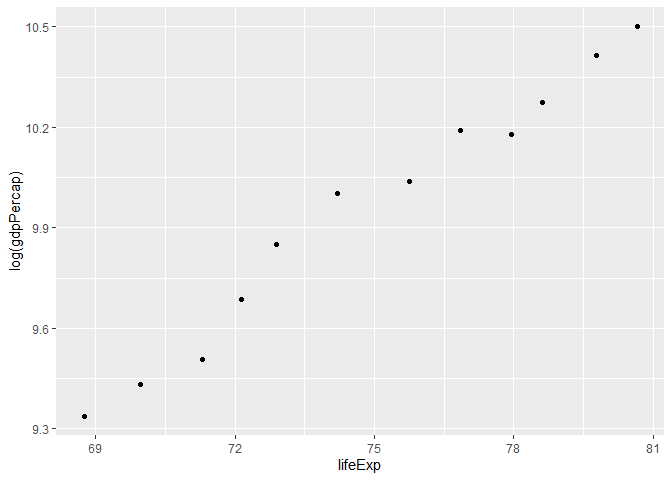
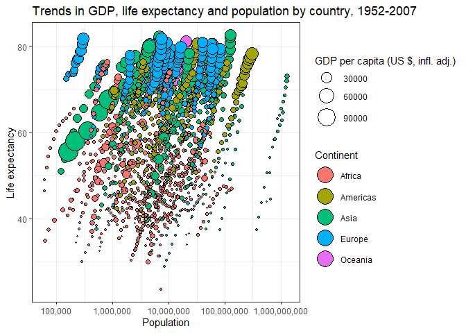
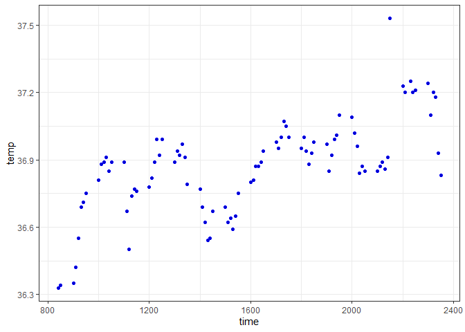
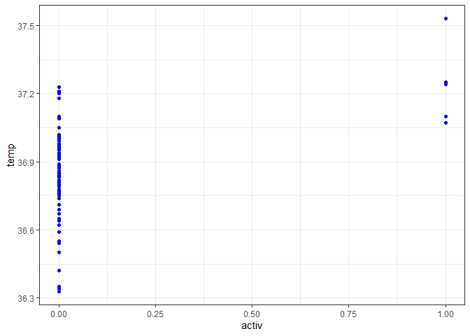
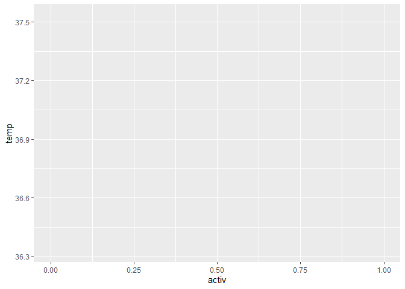

```r
# load your packages here:
library(gapminder)
library(tidyverse)
library(ggplot2)
```

## Exercise 1: Basic dplyr

#### Exercise 1.2 

Use the pipe operator %>% to select “country” and “gdpPercap” from your filtered dataset in 1.1 


```r
gapminder %>%
filter(country %in%  c("Australia", "Canada", "Germany")) %>% 
  group_by(country) %>% 
  slice(5:6) %>%
  select(country, year, gdpPercap) 
```

```
## # A tibble: 6 x 3
## # Groups:   country [3]
##   country    year gdpPercap
##   <fct>     <int>     <dbl>
## 1 Australia  1972    16789.
## 2 Australia  1977    18334.
## 3 Canada     1972    18971.
## 4 Canada     1977    22091.
## 5 Germany    1972    18016.
## 6 Germany    1977    20513.
```

#### Exercise 1.3 

Filter gapminder to all entries that have experienced a drop in life expectancy. 

delta_lifeExp is the change in life exptancy from 3 years prior to the the value in the year column. 


```r
gapminder %>% 
  mutate(lifeExp, lag_lifeExp = lag(lifeExp)) %>% 
  mutate(lifeExp, delta_lifeExp = lifeExp - lag_lifeExp) %>%
  select(country, year, delta_lifeExp) %>%
  drop_na(delta_lifeExp)
```

```
## # A tibble: 1,703 x 3
##    country      year delta_lifeExp
##    <fct>       <int>         <dbl>
##  1 Afghanistan  1957        1.53  
##  2 Afghanistan  1962        1.66  
##  3 Afghanistan  1967        2.02  
##  4 Afghanistan  1972        2.07  
##  5 Afghanistan  1977        2.35  
##  6 Afghanistan  1982        1.42  
##  7 Afghanistan  1987        0.968 
##  8 Afghanistan  1992        0.852 
##  9 Afghanistan  1997        0.0890
## 10 Afghanistan  2002        0.366 
## # ... with 1,693 more rows
```

The data was then sorted to display the countries that experienced the largest drop in life expectancy from 2002 to 2007 at the top of the table. 


```r
gapminder %>% 
  mutate(lifeExp, lag_lifeExp = lag(lifeExp)) %>% 
  mutate(lifeExp, delta_lifeExp = lifeExp - lag_lifeExp) %>%
  filter(delta_lifeExp < 0) %>%
  arrange(-desc(delta_lifeExp)) %>% 
  select(country, year, delta_lifeExp) %>%
  drop_na(delta_lifeExp)
```

```
## # A tibble: 221 x 3
##    country                   year delta_lifeExp
##    <fct>                    <int>         <dbl>
##  1 Central African Republic  1952         -45.2
##  2 Somalia                   1952         -44.9
##  3 India                     1952         -44.4
##  4 Sierra Leone              1952         -43.7
##  5 Gabon                     1952         -43.7
##  6 Djibouti                  1952         -43.5
##  7 Oman                      1952         -42.6
##  8 Angola                    1952         -42.3
##  9 Benin                     1952         -41.2
## 10 Burkina Faso              1952         -41.0
## # ... with 211 more rows
```


```r
gapminder %>% 
  mutate(lifeExp, lag_lifeExp = lag(lifeExp)) %>% 
  mutate(lifeExp, delta_lifeExp = lifeExp - lag_lifeExp) %>%
   filter(year == 2007) %>%
  arrange(-desc(delta_lifeExp)) %>% 
  select(country,delta_lifeExp) %>%
  drop_na(delta_lifeExp) %>%
  rename(delta_lifeExp_2002_2007 = delta_lifeExp)
```

```
## # A tibble: 142 x 2
##    country      delta_lifeExp_2002_2007
##    <fct>                          <dbl>
##  1 Swaziland                     -4.26 
##  2 South Africa                  -4.03 
##  3 Lesotho                       -2.00 
##  4 Mozambique                    -1.94 
##  5 Gabon                         -0.026
##  6 Chad                           0.126
##  7 Nigeria                        0.251
##  8 Italy                          0.306
##  9 Jamaica                        0.520
## 10 Montenegro                     0.562
## # ... with 132 more rows
```

### Exercise 1.4 

Filter gapminder so that it shows the max GDP per capita experienced by each country. 


```r
gapminder %>% 
  group_by(country) %>%
  filter(gdpPercap == max(gdpPercap)) %>% 
  select(country, year, gdpPercap) %>%
  rename(Max_GDPperCap = gdpPercap)
```

```
## # A tibble: 142 x 3
## # Groups:   country [142]
##    country      year Max_GDPperCap
##    <fct>       <int>         <dbl>
##  1 Afghanistan  1982          978.
##  2 Albania      2007         5937.
##  3 Algeria      2007         6223.
##  4 Angola       1967         5523.
##  5 Argentina    2007        12779.
##  6 Australia    2007        34435.
##  7 Austria      2007        36126.
##  8 Bahrain      2007        29796.
##  9 Bangladesh   2007         1391.
## 10 Belgium      2007        33693.
## # ... with 132 more rows
```

### Exercise 1.5 

Produce a scatterplot of Canada’s life expectancy vs. GDP per capita using ggplot()


```r
gapminder %>%
  filter(country == 'Canada') %>%
  ggplot(aes(lifeExp, log(gdpPercap))) +
  geom_point()
```

<!-- -->

```r
# want to add labels corresonding to the year for each point 
```

# Exercise 2 

### Categorical Variable Exploration 

Exploring the GDP per capita (gdpPercap) for the countries in Asia for the year 2007. The GDP per capita is stated in USD. 

**Maximum GDP Per Capita**


```r
gapminder %>%  # was, trying to show the higest and the lowest gdppercap in 1 table 
  filter(continent == 'Asia') %>%
  filter(year == 2007) %>%
  group_by(country) %>%
  summarize(gdpPercap = max(gdpPercap)) %>%
  top_n(1)  
```

```
## Selecting by gdpPercap
```

```
## # A tibble: 1 x 2
##   country gdpPercap
##   <fct>       <dbl>
## 1 Kuwait     47307.
```

**Minimum GDP Per Capita**


```r
gapminder %>%  # was, trying to show the higest and the lowest gdppercap 
  select(country, continent, year, gdpPercap) %>%
  filter(continent == 'Asia') %>%
  filter(year == 2007) %>%
  group_by(country) %>%
  summarize(gdpPercap = max(gdpPercap)) %>%
  top_n(-1)  
```

```
## Selecting by gdpPercap
```

```
## # A tibble: 1 x 2
##   country gdpPercap
##   <fct>       <dbl>
## 1 Myanmar       944
```
** The average GDP per Capita for the year 2007 ** 


```r
gapminder %>%  
  filter(continent == 'Asia') %>%
  filter(year == 2007) %>%
  summarize(gdpPercap = mean(gdpPercap)) 
```

```
## # A tibble: 1 x 1
##   gdpPercap
##       <dbl>
## 1    12473.
```

Minimum and Maximum GDP per capita in 2007 in Asia 

| **Country**  | **GDP per Capita in 2007** | 
-------------------------------------
| Myanmar  | 944 |
| Kuwait   | 47307 |

Total GDP per capita in Asia for 2007 


```r
gapminder %>%  
  filter(continent == 'Asia') %>%
  filter(year == 2007) %>%
  summarize(gdpPercap = sum(gdpPercap)) 
```

```
## # A tibble: 1 x 1
##   gdpPercap
##       <dbl>
## 1   411610.
```


## Exercise 3: Explore various plot types


```r
gapminder %>%
  ggplot(aes(x=pop, y=lifeExp, size=gdpPercap, fill=continent)) +
    geom_point(pch=21,colour="black") +
    scale_x_log10("Population", labels=scales::comma) +
    ylab("Life expectancy") +
    theme_bw() +
    scale_size_continuous(name="GDP per capita (US $, infl. adj.)", range=c(0.5,10)) +
    scale_fill_discrete(name="Continent") +
    guides(fill = guide_legend(override.aes = list(size=8))) +
    labs(title="Trends in GDP, life expectancy and population by country, 1952-2007")
```

<!-- -->


Source for description of data:
https://stat.ethz.ch/R-manual/R-devel/library/datasets/html/beavers.html 

#### Description of Dataframe 

Reynolds (1994) describes a small part of a study of the long-term temperature dynamics of beaver *Castor canadensis* in north-central Wisconsin. Body temperature was measured by telemetry every 10 minutes for females. The data used corresponds to 1 day in December, starting at 8:40 am (840) to 23:50 (2350). Temperatures are in degree celsius. 


```r
beaverday <- data.frame(beaver1) %>% 
  slice(1:91)
```


```r
ggplot(beaverday, aes(time, temp)) + 
  geom_point(aes(time, temp)) + 
  geom_point(colour = "blue", alpha = 0.8) +
  theme_bw()
```

<!-- -->

Scatter plot to show the relationship between inactivity (0) and activity (1). 


```r
ggplot(beaverday, aes(activ, temp)) + 
  geom_point(aes(activ, temp)) + 
  geom_point(colour = "blue", alpha = 0.8) +
  theme_bw()
```

<!-- -->
However, this is not an ideal way to display this relationship. A ** boxplot** would be a better option to show the spread of body temperature for when beavers are inactive or active and to show the average temperature. 


```r
beaverday %>%
  ggplot(aes(activ, temp, group = 2)) 
```

<!-- -->

```r
  stat_boxplot(fill = NA)
```

```
## geom_boxplot: na.rm = FALSE
## stat_boxplot: na.rm = FALSE, coef = 1.5
## position_dodge2
```
