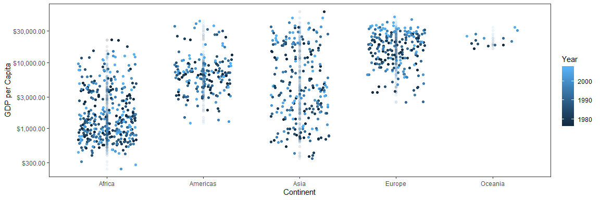
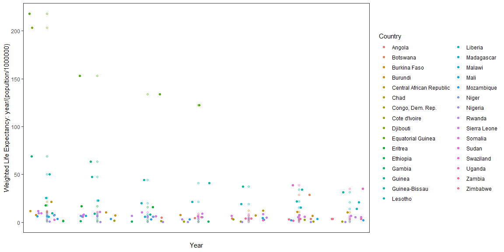

---
title: "Assignment 3"
author: "Linda Dumalo"
date: "October 1, 2019"
output:
  html_document:
    keep_md: yes
  pdf_document: default
--- 


## **Task 3** 

Look at the spread of GDP per capita within the continents. 

GDP per capita by continent was analyzed from 1982 to 2007 using the Gapminder dataset and is displayed on the jitter plot below. 


```r
#maybe change some dimensions 
gapminder %>% 
  filter(year > 1976) %>% 
  rename("Year" = "year") %>% 
  ggplot(aes(continent, gdpPercap, colour = Year)) + 
  geom_jitter(width = 0.3) + 
  geom_point(alpha = 0.08) + 
  xlab("Continent") +
  scale_y_log10("GDP per Capita", labels= scales::dollar_format()) + 
  theme_bw() + 
  theme(panel.grid.major = element_blank(), panel.grid.minor = element_blank()) 
```

<!-- -->

```r
  # if tie permits, add some labels 
```

```r
gapminder %>% 
  filter(year > 1976) %>% 
  rename("Year" = "year") %>% 
  summarize(maxGDPperCap = max(gdpPercap), Year = Year[gdpPercap == maxGDPperCap], continent = continent[gdpPercap == maxGDPperCap], country = country[gdpPercap == maxGDPperCap]) 
```

```r
gapminder %>% 
  filter(year > 1980) %>% 
  rename("Year" = "year") %>% 
  summarize(minGDPperCap = min(gdpPercap), Year = Year[gdpPercap == minGDPperCap], continent = continent[gdpPercap == minGDPperCap], country = country[gdpPercap == minGDPperCap]) 
```

The maximum GDP per capita was seen in 1977 by Kuwait ($ 59265) and the minimum value experienced was seen in the Democratic Republic of Congo in 2002 ($ 241). 

## **Task 5** 


```r
gapminder %>% 
  group_by(continent, year) %>%
  summarise(lifeExp=mean(lifeExp)) %>%
  rename("Continent" = "continent") %>% 
  ggplot(aes(x=year, y=lifeExp, color=Continent)) +
  geom_line(size=1) + 
  geom_point(size = 1.2) + 
  xlab("Continent") + 
  ylab("Life Expectancy (Years)") + 
  theme_bw() + 
  theme(panel.grid.major = element_blank(), panel.grid.minor = element_blank()) 
```

<!-- -->


## ** Task 4 ** 

Analysis of life expectancy from thenormalized to population from the years 1977 to 2007 for countries in the lowest quartile. For the Gapminder dataset this corresponds to the years 1977, 1982, 1987, 192 and 1997, 2002 and 2007. The majority of countries were in Africa so these were displayed on the jitterplot. 


```r
# ideally would have life to have found the quartile by filtering of years first 
quantile(gapminder$lifeExp)
```

```
##      0%     25%     50%     75%    100% 
## 23.5990 48.1980 60.7125 70.8455 82.6030
```

```r
x <- 48.198 # storing the value for the quartile 
```

```r
gapminder %>% 
  filter(year %in% (1977: 2007)) %>% 
  filter(lifeExp < x)
# 36 different countries, mostly in Africa 
```


```r
gapminder %>% 
  filter(year %in% (1977: 2007)) %>% 
  filter(lifeExp < x, continent == 'Africa') %>% 
  mutate(wlifeExp = lifeExp/(pop/1000000)) %>% 
  arrange(year) %>%
  rename("Country" = "country") %>% 
  ggplot(aes(year, wlifeExp, fill = Country, colour = Country)) +
  geom_jitter(width = 1.8) + 
  geom_point(alpha = 0.3) +
  theme_bw() +
  scale_x_discrete(name = "Year", breaks = c("1977", "1982", "1987", "1992", "1997", "2002", "2007"), labels = c("1977", "1982", "1987", "1992", "1997", "2002", "2007"), limits = c("1977", "1982", "1987", "1992", "1997", "2002", "2007")) +  
  ylab("Weighted Life Expectancy: year/(popultion/1000000)") + 
  xlab("Year") + 
  theme(panel.grid.major = element_blank(), panel.grid.minor = element_blank()) 
```

<!-- -->


